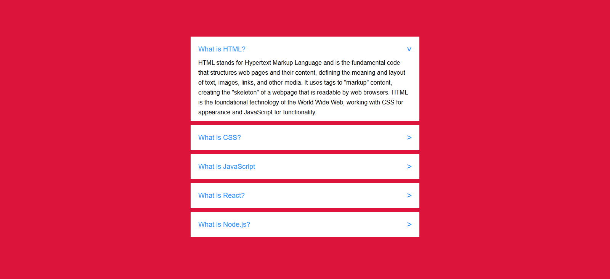

# Accordion

A simple and responsive accordion built with **HTML** and **CSS**.  
This project demonstrates how to create a clean accordion effect using only CSS with hidden radio inputs and labels — no JavaScript required.

## Features
- Pure CSS accordion (no JavaScript needed)  
- Smooth expand/collapse transitions  
- Only one section open at a time (radio button logic)  
- Rotating arrow icon for better UX  
- Clean and minimal design  

## Demo
When a section header is clicked, the corresponding content expands while collapsing the others.

